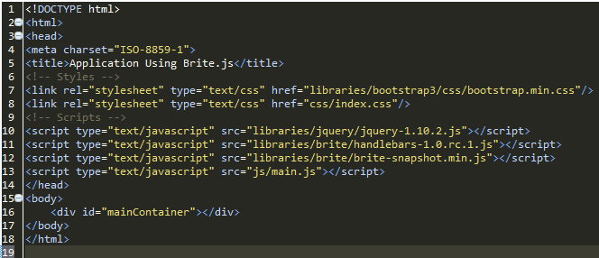
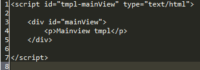

# Free Software
Feel free to use this code.
Powering online learning.

Web Development using templates with BriteJs
============================================

The use of templates has been increasing these days, becoming more popular and with it many frameworks have came out with interesting solutions. One of the advatages that i found is that you can divide your interfaces and develop them in a better and more organized way. There are lots of frameworks that use this modality, and in this case i chose BriteJs.

BriteJs is an MVC framework for templating and it is not very common but i found it really powerful. We will see the main funcionalities and basic structure that you will require in your code. The complete code is found in this repository, you can include it to your project easily, all the libraries needed are in the folder /briteApp/libraries.

To use briteJs you will have two dependencies:

- Jquery
- Handlebars

You will include these libraries in your index.html, and it is also recommended to use Bootstrap 3 that is almost in my
opinion one of the most powerful front-end libraries well known these days.

The order you will include your files in your index.html will be:

- Bootstrap (If included)
- Your css files
- Jquery
- Handlebars
- Brite
- Your Scripts

After that the structure will be very simple. Brite use a default source packages:

- Source
	- js/
	- css/
	- tmpl/
	- index.html

NOTE: Js, Css, and Tmpl will be folders

In briteJs you will have one js file, one css file for each tmpl file. This is default, but if you want for example just
one css file for all the templates you can also do that by typing the following.

<pre>
	brite.viewDefaultConfig.loadTmpl = true;	
	brite.viewDefaultConfig.loadCss = false;
</pre>

Note that you can also disable the loading of the template.

Now, we will see what we will have in each archive.

##Main.js

There will be some archives that it is mandatory to have. This main.js is one of them, and this is the file where you will configure your application with brite, and also will register the templetes that you will use.

<pre>

// Managing the template loading
Handlebars.templates = Handlebars.templates || {};

var render = fuction(templateName, data) {
	
	var tmpl = Handlebars.templates[templateName];
	
	if (!tmpl) {
		
		tmpl = Handlebars.compile($("#" + templateName).html());
		Handlebars.templates[templateName] = tmpl;
		
	}
	return tmpl(data);
}

brite.viewDefaultConfig.loadTmpl = true;	
brite.viewDefaultConfig.loadCss = false;

/* Here you will display the template. The parameters are: 
* 1. The name of the view
* 2. The element where you will introduce the other template (It should be an ID because it's supposed to be unique)
*/

brite.display("mainView", "#mainContainer");
</pre>

##xName.tmpl

The structure is really simple, and it is as follows.

Inside the mainView div element, you will have the code of your template and it will be embedded in the element that you chose in the javascript file before.

##mainView.js

This is the basic structure of your scritp, where you will do all your functionalities and this is where the framework becomes interesting.

<pre>

(function($) {

    brite.registerView("mainView", {emptyParent:true, loadCss:false}, {

        create: function(data, config) {
        	//Returns the view
        	return render("tmpl-mainView", data);
        },

        init: function(data, config){
        },

        /*
         * will be called after the init
         */
        postDisplay: function(data, config){
        	
        },

        /*
         * Called when the view is removed.
         */
        destroy: function() {

        },
	
	/* Here you can use every element that is supported in jquery
	 * E.g. change, click, keyup, keypressed, hover, blur and so on.
	 * The way it is used is as follows. 
	 * Event; selector
	 */
        events: {
        	"click; #myElementId",
			"change; .myElementClass"
        }
    });

})(jQuery);

</pre>

It has default methods where you can do any stuff needed. "events" is a good place to bind all the events you need, and it will support any method of jquery (binding methods).

One more interesting thing you can do is use a brite element that acts like a 'this' element, so that it will be 'this' just in this template. So let's say we have a div element called 'container' in two different templates.

If i use it as follows, it could be found many times in the interface.

<pre>
	$('#container');
</pre>

But if use it like this:

<pre>
	this.$el.find('#container');
</pre>

It will find it just the number of times the element appears in THIS template.

Finally, as you can see, brite notations are really simple and clean, creating a very readable js code, separating the files and templates in a beautiful way, and personally i can recommend it a lot.

It's just an introductory tutorial, but you can also find the documentation an a good explanation of the framework at <a href="http://britesnow.com/brite" >BriteJs</a>

